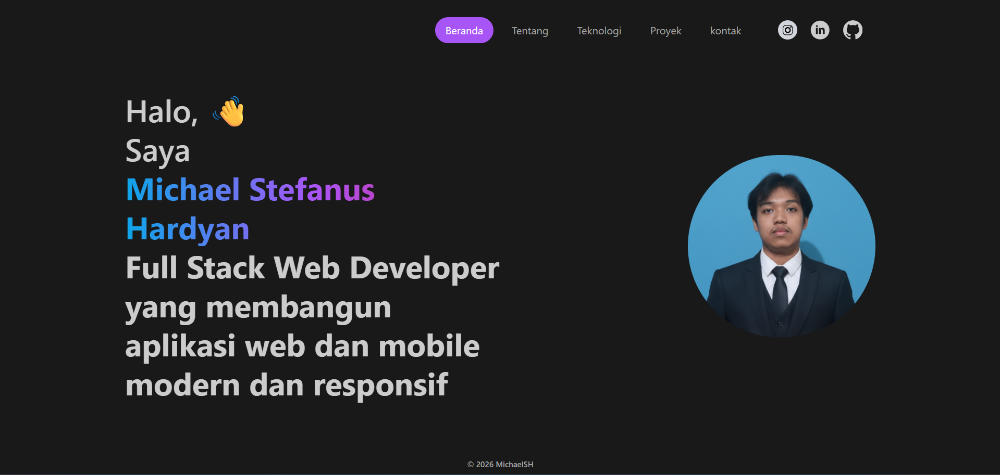

# My Portfolio

Portfolio pribadi berbasis React untuk menampilkan profil, skill, dan project yang pernah saya kerjakan.

## Tentang Project

Website ini dibuat untuk menampilkan informasi tentang saya sebagai developer, termasuk:

* profil singkat
* teknologi yang saya gunakan
* daftar project
* kontak

## Tech Stack

* React.js
* JavaScript
* Tailwind CSS
* MockAPI

## Fitur

* Tampilan portfolio modern dan responsif
* Menampilkan project dari API
* Section About, Technologies, Projects, dan Contact

## Menjalankan Project

```bash
npm install
npm start
```

## Preview



## Contact

* Email: [mstefanus090@gmail.com](mailto:mstefanus090@gmail.com)
* GitHub: https://github.com/michaelsh-dev
* LinkedIn: https://linkedin.com/in/michael-stefanus-hardyan

## Catatan

Project ini akan terus diperbarui seiring bertambahnya pengalaman dan hasil belajar saya.